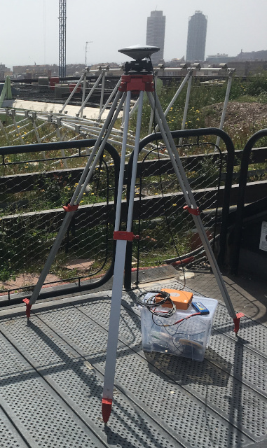

# Accuracy analysis

This section includes an accuracy analysis we have performed with Jason for
you to have an idea of which accuracy you can obtain with the service

## GNSS geodetic-grade receiver (static)

The purpose of this test was to assess the accuracy that can be achieved using
a geodetic grade GNSS receiver and antenna in static mode (non moving platform).

|Test setup||
|:----|:------|
|GNSS receiver | Septentrio AsteRx|
|Antenna | Septentrio PolaNT |
|Environment | Rooftop, open sky|
|Data length |  2.34 hours |
|Sampling rate | 15 second |
|Number of epochs | 560 |
|GPS start time | 2019 Nov 18  12:45:30.000 |
|GPS end time | 2019 Nov 18  15:05:15.000 |

The test setup (performed at the rooftop of Rokubun's headquarter offices at the
MediaTIC building) is shown in the following picture:

The Septentrio AsteRx data has been processed with Jason with the following
main characteristics:

|Processing characteristics||
|:---|:---|
|Strategy| Post-Processing Kinematic (PPK)|
|Dynamics| static |
|GNSS receiver | Leica GR50 |
|Antenna | Leica AR25 |
|Reference station | ICGC PLAN (17.4km baseline) |
|Sampling rate | 30 second |

In order to assess the results, the same data file (converter to RINEX) has been
processed using [Canadian Geodetic Survey of Natural Resources Canada Precise Point Positioning (CSRS-PPP)](https://webapp.geod.nrcan.gc.ca/geod/tools-outils/ppp.php?locale=en) (PPP) 
tool. The differences are shown in the table below:

|component| NRCAN PPP (final products) | Jason PPK | difference (vs NRCAN)|
|:---:|:---:|:----:|:----:|
| UTM_X   |    432640.419      | 432640.414   |    -0.005 |
| UTM_Y   |    4583770.355     |  4583770.352 |    -0.003 |
| ellipsoidal   |   92.638     | 92.561 |    -0.077 |

Please note that we are currently working on fix that will properly compute the antenna height.

## Smartphone (non-moving dynamic)

This test intends to provide an estimate accuracy of the best accuracy that can
be achieved with a smartphone in the most benign environment possible (non moving,
open sky, no multipath)

|Test setup||
|:----|:------|
|GNSS receiver | Xiaomi Mi 8 |
|Antenna | internal |
|Environment | Rooftop, open sky, no multipath structures nearby |
|Data length |  7 minutes |
|Sampling rate | 1 second |
|Local time | 2019 Nov 19  12:17 |

The smartphone was colocated on the same point at which the antenna of
[the static test](#gnss-geodetic-grade-receiver-static). The data was then
processed with Jason with the following processing strategy:

|Processing characteristics||
|:---|:---|
|Strategy| Post-Processing Kinematic (PPK)|
|Dynamics| Smartphone was not moving, but processed with kinematic stochastics |
|Reference station | IGN BCLN (16km baseline) |

 - AsteRx(static)")
