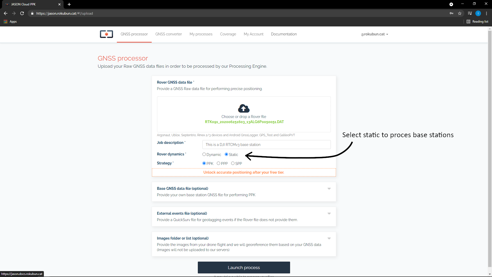

# Usage examples

This section includes several usage examples that cover most of the use cases
that Jason could support. Go to the [quick start guide](../quickstart) for a
n example of a basic usage with a single rover file.

This section will use the term _rover_ instead of _receiver_ in order to
distinguish it from a _reference receiver_ (or _base receiver_), which is
usually static and is used to provide corrections to the (usually) moving
(roving) receiver.

## Rover and base files

If the area you are surveying does not have a nearby CORS station, you can use
your own reference GNSS receiver. During the campaign make sure you collect
data at the same time as your rover and then process the rover GNSS data together
with the GNSS data from the base station.

To execute this example, follow these steps:

1. Download the [sample rover](https://github.com/rokubun/jason-docs/blob/master/assets/argonaut_cam.rok?raw=true) and [base station](https://github.com/rokubun/jason-docs/blob/master/assets/PLAN00ESP_R_20180580000_01D_30S_MO.obs?raw=true) files.
2. Log in with your account and Jason and go to the "GNSS processor" tab.
3. Drag-and-drop the two downloaded files at the _rover_ and _base station_ boxes,
as shown below.

4. Press "Process file" and wait for the process to finish. The rest of the steps
are the same as those of the [quick start guide](../quickstart).

An important note to consider is regarding the **base station coordinates**. If the
input file is in Rinex format and you are confident that the coordinates of the
`APPROX POSITION XYZ` header field are accurate, you do not need to do anything else. However,
you can indicate a proper set of coordinates for the base station in the field
**"External base station position (optional)"** in the form of latitude, longitude
and height. Latitude and longitude shall be expressed in meters while the height
should be expressed in height above the WGS84 ellipsoid.

Also note that the formats supported by the base station are the same as the 
ones supported by the rover receiver.

## Static receiver, RTCM 3 format

The use case for this example is in the event that you deploy a base station
so that it transmits the data via NTRIP to an NTRIP caster. Rover receivers
can then connect to this caster but need the precise coordinates of this base
station, so you use Jason to get those precise coordinates.
station.

Once the base station is serving data to the NTRIP caster, the operator can
record data into `rtcm3` format using e.g. [rtklib](http://www.rtklib.com)'s `str2str` tool.
After you log in into Jason, send the data, as shown in the following figure
(for a data file `bcln0.rtcm3`)



One point to take into account is the fact that the file conversion within
Jason does not allow the user to specify the approximate date of the file.
Therefore, unless the RTCM3 file is recent (within the same GPS week), the
RTCM3 file will not he processed. Therefore, the recommended approach would
be to convert the rtcm3 file into Rinex and then upload it to the service.
If you use `rtklib`'s `convbin` tool, you can launch the command:

```bash
convbin -r rtcm3 -v 3.03 -f 3 -scan -o bcln0.rinex bcln0.rtcm3
```

Then upload the file `bcln0.rinex` to Jason.

You will get this station precise coordinates that can be further used by rovers using this station in the NTRIP caster.
