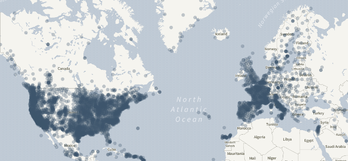

# Welcome to Jason documentation

Jason is Rokubun's Cloud PPK Service, a cloud service that compute
the position of a receiver using the raw GNSS measurements.

Jason works on a best-effort basis: it will attempt to compute the best possible
solution using a differential technique known as Post-processing Kinematic (PPK),
which is the post-processing version of the Real Time Kinematics (RTK). These
techniques combine GNSS measurements from nearby **reference stations** with
those of the rover being positioned to cancel out most of the common errors 
(ionosphere, troposphere, ...). By _nearby_ it is usually considered less than
30km apart. Depending on the input format you provide, centimetric accuracies 
can be achieved.

Do not have a reference station? **Worry not!** we have you covered, Jason will
automatically look for a suitable reference station (CORS), among the ones regularly
monitored by the service, and use it to try to achieve the best possible accuracy
for your data.

## Features

- **Ease of use**, drag and drop GNSS files 
- Process [various input formats](../manual#supported-formats) (RINEX, ublox, Septentrio, Android GNSS Logger, ...)
- Georeference **time (e.g. camera trigger) events**, which is relevant for the photogrammetry use case
- Differential positioning for greater accuracy without the need to deploy a
  base station, Jason will **automatically search/fetch/use the closest base station** among
  the database of more than 10000 stations tracked by our servers
- Application Programming Interface (**API**) to automate your
  GNSS data processing workflow. You can include it in your application pipeline
  without the need to go through the front-end.
- **Data conversion service** for Argonaut/Medea owners: generate Rinex file, IMU
  data and time trigger (cam) events from a binary file logged by the receiver.

## Use cases

Jason aims at providing a platform of various potential services and use cases
that share the same common need: accurate navigation. Examples of such services
and applications follow:

### Photogrammetry

Jason was created with the photogrammetry workflow in mind: a drone logs both
raw GNSS data as well as triggers several photographs, whose time tags are
also logged by the receiver (Argonaut supports that as well as the NEO-M8T and
ZED-F9P chipsets from ublox). The operator does not worry about base station
because he made sure that the campaign area is under Jason coverage.

Once the campaign is over, the operator uploads the data to our service, which
will automatically find the closest base station available and compute both
the navigation solution (ideally using PPK) as well as georeference any time
(camera) event present in the input file. This data can be later used in 
further steps of the processing.

This use case is the one covered in the [quick start](../quickstart) of the manual

### End-to-end PPK

This use case is similar to the previous case (an operator that performs 
a data campaign where GNSS raw measurements can be logged for later processing),
but outside the coverage of Jason. In this case the operator provides her own
base station that is active during the campaign, also logging GNSS raw measurements.

This data is then uploaded in the service, as describe in this [example](examples#rover-and-base-files).

## Coverage

The data from the reference stations come from a set of world-wide public providers such
as [International GNSS Service](https://www.igs.org) or [EUREF](http://www.epncb.oma.be/) as
well as smaller national and regional networks such as the [Institut Cartogràfic i Geològic de Catalunya](https://www.icgc.cat) and the like.

In total, we continuously monitor the availability of more than 10000 CORS stations
distributed worldwide. Some areas are better covered than others but unfortunately
we cannot provide global coverage.

