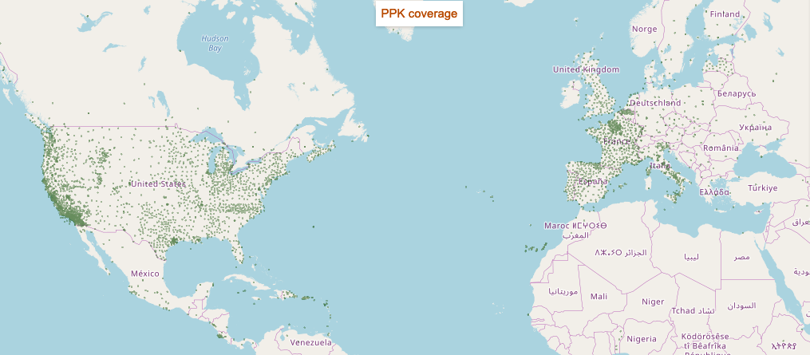

# Welcome to Jason documentation

Jason is Rokubun's Positioning-as-a-Service (PaaS), a cloud service that compute
the position of a receiver using the raw GNSS measurements.

Jason works on a best-effort basis: it will attempt to compute the best possible
solution using a differential technique known as Post-processing Kinematic (PPK),
which is the post-processing version of the Real Time Kinematics (RTK). These
techniques combine GNSS measurements from nearby **reference stations** with
those of the rover being positioned to cancel out most of the common errors 
(ionosphere, troposphere, ...). By _nearby_ it is usually considered less than
30km apart. Depending on the input format you provide, centimetric accuracies 
can be achieved.

Do not have a reference station? **Worry not!** we have you covered, Jason will
automatically look for a suitable reference station (CORS), among the ones regularly
monitored by the service, and use it to try to achieve the best possible accuracy
for your data.

## Features

- **Ease of use**, drag and drop GNSS files 
- Process [various input formats](../manual#supported-formats) (RINEX, ublox, Septentrio, Android GNSS Logger, ...)
- Georeference **time (e.g. camera trigger) events**, which is relevant for the photogrammetry use case
- Differential positioning for greater accuracy without the need to deploy a
  base station, Jason will **automatically search/fetch/use the closest base station** among
  the database of more than 10000 stations tracked by our servers
- Application Programming Interface (**API**) to automate your
  GNSS data processing workflow. You can include it in your application pipeline
  without the need to go through the front-end.
- **Data conversion service** for Argonaut/Medea owners: generate Rinex file, IMU
  data and time trigger (cam) events from a binary file logged by the receiver.

## Coverage

The data from the reference stations come from a set of world-wide public providers such
as [International GNSS Service](https://www.igs.org) or [EUREF](http://www.epncb.oma.be/) as
well as smaller national and regional networks such as the [Institut Cartogràfic i Geològic de Catalunya](https://www.icgc.cat) and the like.

In total, we continuously monitor the availability of more than 10000 CORS stations
distributed worldwide. Some areas are better covered than others but unfortunately
we cannot provide global coverage.

