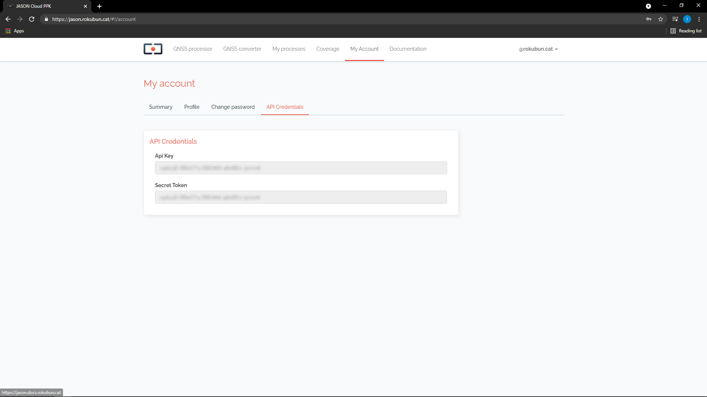

# Manual

## Processing engine

Under the hood, Jason runs the open-source package
[rtklib](http://wwww.rtklib.com) as the positioning engine, whilst Rokubun positioning engine is getting ready for deployment. This service works
on a best-effort basis, and attempts to run these
[processing strategies](../strategies) in the following prioritized order:

- _PPK_, Jason computes a coarse estimate of the rover position using _SPP_ in
  order to have a rough estimate of the receiver position and be able to
  automatically select the closest base station from the set of
  [stations continuously monitored by Jason](https://jason.rokubun.cat/#!/login#coverage).
  If a nearby station is found (less than a certain baseline),
  then the corresponding RINEX data is downloaded in order to perform differential
  positioning. Alike, if you provide Jason with a base station measurements file, it will undergo _PPK_ technique processing.
- _PPP_, if no reference data is found, Jason will attempt PPP if the precise
  orbits and clocks for the day to be processed are found and the input data
  is multi-frequency.
- _SPP_, if _PPP_ failed, the data processed using the broadcast orbits and 
  clocks will be delivered.

## Supported formats

Jason supports the following input formats to input GNSS observables
(pseudorange, carrier-phases, ...):

- Rinex 2/3
- ublox formats (both single and multiple frequency formats). Data from chipsets
  such as NEO-M8T or ZED-F9P are supported. This obviously cover also all GNSS
  receivers that use these chipsets (e.g. Drotek, EMLID receivers, ArduSimple, ...)
- Data from Rokubun's receivers (Argonaut and Medea, which are Ublox-based, but
  also adding IMU and Event data)
- [Google's Android GNSS logger](https://github.com/google/gps-measurement-tools/tree/master/GNSSLogger) (smartphone data)
- RTCM 3 data
- Septentrio binary (SBF) files

## API

For workflows that require to process several GNSS files in batch, Jason
provides an Application Programming Interface (API) that allows to automate
the complete processing or to include the positioning estimation step in your
application pipeline (for example automated photogrammetry software).

In fact, Jason is fully implemented as an API and the front-end simply uses
it. The API allows that you to e.g. program tasks in Jason using URLs via
the command line of your Operating System or create plugins.

### Launching a process

Let' assume you have a GNSS data file in RINEX format named `GARR2150.15o` that
you wish to process. Let's also assume you have your API key and secret token
ready ([fetch them in your user section](#how-to-obtain-your-api-key)):

```bash
export APIKEY="jason_api_key_here"
export SECRET_TOKEN="your_secret_token_here"
```

With this information you can fire a process with a `curl` command, like so:

```bash
curl -X POST  -H "accept: application/json" \
                       -H "Content-Type: multipart/form-data" \
                       -H "ApiKey: ${APIKEY}"  \
                       -F  token=${SECRET_TOKEN} -F type=GNSS  \
                       -F "rover_file=@GARR2150.15o"  \
                                "http://api-argonaut.rokubun.cat/api/processes/"
```

Now the process is being run in Rokubun's servers. The previous command replies
with a small JSON formatted string with the status of the command (success
indicates that the process has been correctly launched) and the process id that
has been assigned (in this example the process id is 707):

```json
{"message":"success","id":707} 
```

You can check the status of the process at any time under the tab **My processes**
in your user area of the front-end or, alternatively with this curl command
(that will answer with a JSON string):

```bash
curl -X GET -H "ApiKey: ${APIKEY}" \
                     -H "accept: application/json"  \
                     "http://api-argonaut.rokubun.cat/api/processes/707?token=${SECRET_TOKEN}"
```

The JSON string will give details on the run as well as any log messages that
describe what is being done with the file (PPK, PPP, SPP, ... depending on the
data availability). A sample is shown below:

```json
{
  "process": {
    "id": 707,
    "user_id": 24,
    "type": "GNSS",
    "status": "RUNNING",
    "source_file": "https://argonaut-files.s3.eu-central-1.amazonaws.com/source_files/258ab2a88691ad7cb47d91a832e13aa8/GARR2150.15o",
    "source_base_file": null,
    "camera_metadata_file": null,
    "created": "2018-02-07 14:33:38",
    "finished": null
  },
  "log": [
    {
      "id": 1630,
      "process_id": 707,
      "level": "INFO",
      "message": "[GARR2150.15o] file successfully loaded\n",
      "created": "2018-02-07 14:33:42"
    },
    {
      "id": 1631,
      "process_id": 707,
      "level": "INFO",
      "message": "[Broadcast] orbits successfully downloaded\n",
      "created": "2018-02-07 14:33:45"
    },
    ...  
```

### Downloading the results file

Once the status of the process is finished (`"status": "FINISHED"`, under
`"process"`), the JSON response generated by the previous command will contain,
at the end, the link to the [zipped result file](#gnss-processor-files) with the result of the process:

```json
    ...
        {
      "id": 2043,
      "process_id": 707,
      "url": "https://argonaut-files.s3.eu-central-1.amazonaws.com/results/1589edb715ebbe117bbdefe5e44192e2/results.zip",
      "created": "2018-02-07 14:34:28",
      "name": "results.zip",
      "extension": "zip"
    }
  ]
}
```

You can download the results file via the browser or, if you want to automate 
the process, use Bash scripting, like so:

```bash
wget `json2yaml response.json  | awk '/url/&&/results.zip/{print $2}'`
```

(note that you will need the tool [json2yaml](https://www.npmjs.com/package/json2yaml)
for that to work)

You can also use Python to automate this and download the results file (`results.zip`):

```python
import json
import urllib.request

with open("response.json") as fp:
   res = json.load(fp)

url = res["results"][-1]["url"]
urllib.request.urlretrieve(url)
```

## Result files

This section include the information of the various file formats delivered by
Jason.

### GNSS processor files

When a process has been successful, a compressed (ZIP) file is generated with all the
results of the process. The format of the different files included in the bundle
by the GNSS processor are described in the following sub-sections.

#### Position files (csv)

Positions will be delivered as a comma separated file where the first line is
a comment (starts with `#`) with a description of the fields, which are:

- columns 1-2: **Epoch** of the solution, expressed as GPS week and seconds within the GPS week.
- columns 3-5: **Position** in WGS84 reference frame (latitude, longitude and height). 
                longitude and latitude expressed in decimal degrees and height in
                meters above the WGS84 ellipsoid.
- columns 6-8: Standard deviation in meters of the North, East and Up components.
                Note that these values are the formal **errors** delivered by the
                position filter (i.e. square root of the postfit variances) and
                they do not necessarily reflect the actual error in the
                navigation solution. The surveyor will need an external reference
                to compute the actual error. However, these values can be
                treated as a preliminary quality metrics of the solution.

Jason will always deliver the position file corresponding to the SPP
strategy (files ending with `_spp.csv`). If a more accurate strategy
(PPP or PPK) could be performed, additional CSV will be also delivered,
ending with either `_ppp.csv` or `_ppk.csv`, to indicate the strategy
of the solution.

Example:

```csv
# GPSW,GPSSoW,latitude(deg),longitude(deg),height(m),sdn(m),sde(m),sdu(m)
2069,124585.300000,41.3495230130,1.6680445200,246.06570,2.3403,1.5631,4.6059
2069,124585.400000,41.3495233800,1.6680436110,246.40920,2.3403,1.5631,4.6059
2069,124585.500000,41.3495239180,1.6680507170,246.51000,2.3403,1.5631,4.6058
2069,124585.600000,41.3495241180,1.6680519850,246.22500,2.3403,1.5631,4.6058
2069,124585.700000,41.3495263560,1.6680520780,246.36660,2.3403,1.5631,4.6058
2069,124585.800000,41.3495281560,1.6680502930,245.82960,2.3404,1.5631,4.6058
2069,124585.900000,41.3495297610,1.6680474000,245.42580,2.3404,1.5631,4.6058
```

#### Position files (kml)

For convenience, the positions are converted to [KML format](https://developers.google.com/kml/documentation/)
and included in the ZIP package as well. These files can be easily opened using tools such as
[Google Earth](http://www.google.com/earth), just double-click on the files
and the application will open the file.

Similarly to the case of the CSV files, the KML corresponding to the SPP
strategy will be always delivered. If PPP or PPK has been successful, the
KML files for this strategy will be also delivered. The strategy will be part
of the file name.

In addition, for quick visualization, a **decimated version of the KML** file is
also provided. This is useful for a quick preview of files that have been 
taken in long data campaigns.

In case of **static** receivers, only the last point of the processing will be
included in the KML file.

#### Plots (png)

As a visual summary of the processing task, a series of plots (in PNG format)
are also included in the bundle. These files are:

- `height.png`: Time series of the height above the WGS84 ellipsoid (in meters).
- `skyplot.png`: Skyplot showing the distribution of the satellites that have
                 been used for the processing. The points in the plot have
                 different color coding, depending on the constellation. Also,
                 the satellite ID is also shown at the last point, which is a
                 helper to know the direction to which the satellite moved.
- `num_satellites.png`: The time series of the number of satellite during the
                processing. The same color coding used in the skyplot has been
                used here. The chart is a stack plot and shows the number of
                satellites, at each epoch, of each constellation.

#### Time/Camera events (csv)

In the event that the input contained time events (usually generated from
camera trigger), the output package will also contain a camera event file
`camera_events.csv`. The file contains as many rows as time triggers (camera
events) detected in the input file. Each row of the file contains the time tag,
position and formal error of the camera event, with the same format as 
described above for the Position CSV files.

### GNSS converter files

#### Argonaut IMU file

Rokubun's Argonaut/Medea receivers store GNSS data as well as IMU data from its
inertial sensor. This **data is syncrhonized** with the GPS time scale and stored
in the SD card along with the GNSS raw measurements. When using the conversion
tool from Jason, a CSV file with the IMU data will be generated. The file starts
with a comment line (starting with `#`) that describes each column as well as
the appropriate units:

- `GPSWEEK` The GPS week of the time stamp
- `GPSTOW` The seconds of the GPS week
- `MAGX`, `MAGY`, `MAGZ`, 3 components (XYZ) of the magnetometer, expressed in nano-Teslas
- `GYRX`, `GYRY`, `GYRZ`, 3 components (XYZ) of the gyroscope, expressed in degrees per second
- `ACCX`, `ACCY`, `ACCZ`, 3 components (XYZ) of the accelerometer, expressed in g's (9.81 m/s^2)

All inertial values are referred to the **body reference frame**. Check the
Argonaut/Medea documentation for further details.

Example of IMU file:

```csv
#GPSWEEK GPSTOW MAGX(uT) MAGY(uT) MAGZ(uT) GYRX(º/s) GYRY(º/s) GYR(º/s) ACCX(g) ACCY(g) ACCZ(g)
1990  210938.42492403     -8.400    56.550   -33.600    -2.305    -0.580     0.641    -0.007     0.053    -0.983
1990  210938.43499108     -9.000    55.800   -31.200    -2.290    -0.641     0.626    -0.015     0.060    -0.980
1990  210938.44496808     -7.650    53.700   -33.150    -2.275    -0.702     0.626    -0.010     0.053    -0.985
```

#### Argonaut CAM file

In addition, Argonaut/Medea receivers store any time event that has been
triggered during the data recording campaign by means of a hot-shoe mounted
on a photogrammetry SLR camera or [MicaSense](http://www.micasense.com).
Converting a file that contains
time (cam) events will result in the generation of a file with 2 columns:
(1) the GPS week and (2) the seconds within the GPS week when the time event
took place.

The file has as many rows as events detected by the receiver and the
**time tag is synchronized** to the time scale provided by the GNSS receiver.

If no cam events have been detected, no file will be generated.

Example of CAM (time event) file:

```csv
1990  211188.79867494
1990  211193.86766694
1990  211198.69297889
1990  211201.69084889
1990  211374.67710689
1990  211377.81912194
1990  211380.62477889
```


## User section

In order to go to your user area, point to the top-right part of the page, 
where your e-mail address is displayed, and click on the arrow. A drop-down
menu will be displayed. Then click "My Account" as shown in the screenshot below.


In your account you will find 3 areas:

- **Profile** where you will be able to set your Name and e-mail address.
- **Change password**, to reset your password.
- **Software**, where you will be able to fetch your API key, as shown below.

### How to obtain your API key

In order to use the PaaS API, you will need both the **API key** and
**your secret user token**. While the API key identifies our PaaS and is common
across all users, the secret token is your ID and will link each process you
request with your account.

Once in your area, click on the **Software** tab. In this tab you will find both the API key and
secret token that you need.


