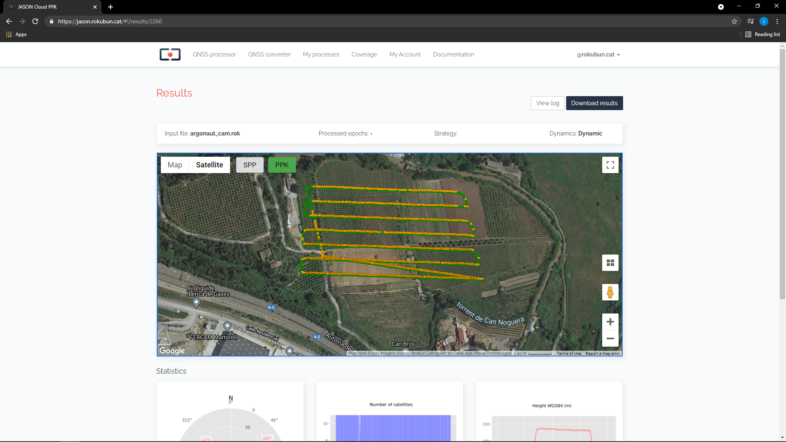

# Quick start guide

This section is intended for those who cannot wait out there :smile: and are
eager to process a file right away. In this guide you will learn:

- How to use Jason to perform a [PPK](../strategies) process using a single
  GNSS binary file obtained from a Ublox receiver.
- View and download results file

This example is the most simple processing case, which turns to be also
the most common processing type performed by our users. You will not need
any base station for this tutorial, just follow these steps:

1. Go to the [Jason web page](https://jason.rokubun.cat) and **register**. You will
  need to specify an e-mail and a password. Once you click "Sign up", you should
  receive an e-mail with a verification link.
2. [Download the test file](https://github.com/rokubun/jason-docs/blob/master/assets/XXXX00CAT_R_20201201204_22M_01S_MO.rnx?raw=true), which has been taken with a DJI Mavic 2 Pro equiped with a [Topodrone PPK system](https://topodrone.org/product/drones/pro/m2p-ppk/)
  and contains GNSS raw measurements and camera events.
3. **Log in** with your credentials into Jason and go to "GNSS Processor"
  (should be the default page after logging in).
4. Drag-and-drop the downloaded file into the "Rover GNSS data file" box. Alternatively,
  you can click the box "Select file" and a file explorer window will pop-up.
  

5. Press **"Process file"**. The file will be uploaded and the processing will start,
   the front-end will issue several progress logs to inform about the strategy
   used and status. When the process is Finished, a button will appear at the 
   bottom of the page.
   

6. Click **"View Results"** to access the results page, which contains
   a map window to show a preview of the results. The map contains both the
   track in SPP and PPP/PPK (if the service could apply one of these processing strategies)
   and also all the camera events (if present in the input file) represented
   as red crosses. The result page also contains 3 images with the satellite
   view, number of satellites as well as height profile (above the ellipsoid).
   Note that for static positioning, only one point will be plot in the map,
   and thus no height profile will be shown.
   

7. You can access the log messages if you click the **"View Log"** box at the top
   of the page and **"Download results"** as a ZIP format. The contents of the
   file are described in the [file format section of this documentation](../manual#result-files).
