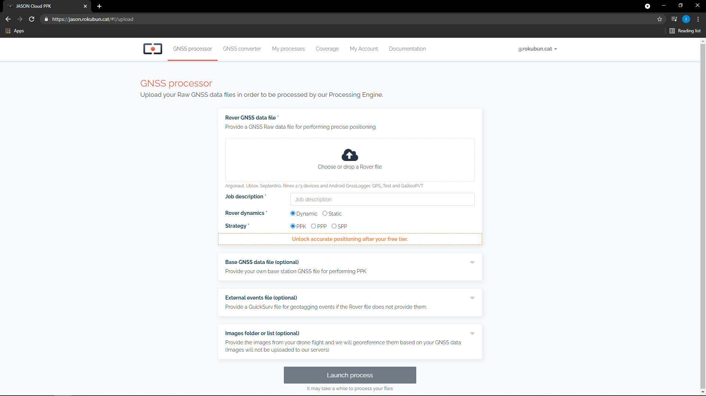

# User section

In order to go to your user area, point to the top-right part of the page, 
where your e-mail address is displayed, and click on the arrow. A drop-down
menu will be displayed. Then click "My Account" as shown in the screenshot below.

In your account you will find 3 areas:

- **Profile** where you will be able to set your Name and e-mail address.
- **Change password**, to reset your password.
- **Software**, where you will be able to fetch your API key, as shown below.

## How to obtain your API key

In order to use the PaaS API, you will need both the **API key** and
**your secret user token**. While the API key identifies our PaaS and is common
accross all users, the secret token is your ID and will link each process you
request with your account.

Once in your area, click on the **Software** tab. In this tab you will find both the API key and
secret token that you need.

